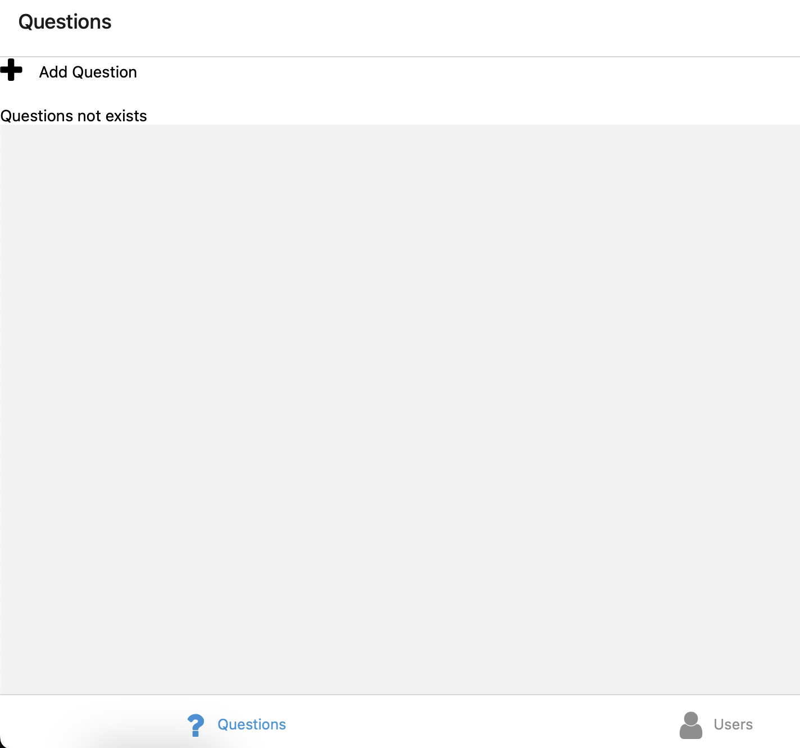

# Instructions

In this directory:

create the postgresql database

To excecute manually the 
```bash
psql -U YOUR_USER -d YOUR_DATABASE -a -f init-postgresdb.sql
```

change the value of env variables in:
backend/.env

# BackEnd

Go to the backend folder and install the packages:
```bash
npm install
```

Execute the server:
```bash
npm start
```

You must watch a similar output like this:
```

> backend@1.0.0 start
> ts-node-dev src/server.ts

[INFO] 20:29:20 ts-node-dev ver. 2.0.0 (using ts-node ver. 10.9.2, typescript ver. 5.4.3)
Server running on http://localhost:3000
```

In the browser or curl invoke this end point to test connection:
http://localhost:3000/users/

You must to whatch this output:
```json
[{
    "id": 2,
    "name": "Homer Simpson",
    "email": "homer@hotmail.com"
}, {
    "id": 3,
    "name": "Lionel Messi",
    "email": "messi@hotmail.com"
}, {
    "id": 1,
    "name": "Richard Martinez",
    "email": "r.martinezdk@gmail.com"
}]
```

For Unit test;
```bash
npm test
```

You must to watch this similar output:
```
> backend@1.0.0 test
> jest

 PASS  src/test/questionController.test.ts
 PASS  src/test/answerController.test.ts
 PASS  src/test/userController.test.ts

Test Suites: 3 passed, 3 total
Tests:       14 passed, 14 total
Snapshots:   0 total
Time:        0.872 s, estimated 1 s
Ran all test suites.
```

# FrontEnd

Go to the frontend folder and install the packages:
```bash
npm install
```

execute the server:

```bash
npm start
```


---
If you could have any error, run:

```bash
npm cache clean --force
rm -rf node_modules
npm install

npm start
```
---


You must to watch any similar, and now in your browser you can navigate to this url regarding to this example: 
http://localhost:8081

```bash
> frontend@1.0.0 start
> expo start

Starting project at /Users/richard/devs/typescript/LimbicCodeChallenge/frontend
env: load .env
env: export API_BASE_URL
(node:52110) [DEP0040] DeprecationWarning: The `punycode` module is deprecated. Please use a userland alternative instead.
(Use `node --trace-deprecation ...` to show where the warning was created)
Starting Metro Bundler
▄▄▄▄▄▄▄▄▄▄▄▄▄▄▄▄▄▄▄▄▄▄▄▄▄▄▄
█ ▄▄▄▄▄ █▄▄▄ ▀█▀█▄█ ▄▄▄▄▄ █
█ █   █ ██▄▀ █ ▀ ▄█ █   █ █
█ █▄▄▄█ ██▀▄ ▄▄██▀█ █▄▄▄█ █
█▄▄▄▄▄▄▄█ ▀▄█ ▀ ▀ █▄▄▄▄▄▄▄█
█▄ ▀▄ █▄▀█▄▀█▄██▀ █▄█▀█▀▀▄█
█▀█▀▄██▄  ▄██▄█▄▄▀▀███▄▀▀ █
█▀▄▄█▄ ▄▀   █▀█▄ █ ▄▀▀█▀ ██
█ ▄▀▀▄▀▄▄██▀█▀▄▀▄▀█▄▀ ▄▀  █
█▄█▄▄▄█▄▄▀▀  ▄▄   ▄▄▄  ▄▀▄█
█ ▄▄▄▄▄ ██  ▀▄ ▄█ █▄█ ███▄█
█ █   █ █  ▄▄▀ ▀▄▄▄  ▄ █  █
█ █▄▄▄█ █▀▄  ▀ ██▄▀▀▀▄█   █
█▄▄▄▄▄▄▄█▄██▄▄▄█▄▄▄▄▄▄███▄█

› Metro waiting on exp://172.20.10.8:8081
› Scan the QR code above with Expo Go (Android) or the Camera app (iOS)

› Web is waiting on http://localhost:8081

› Using Expo Go
› Press s │ switch to development build

› Press a │ open Android
› Press i │ open iOS simulator
› Press w │ open web

› Press j │ open debugger
› Press r │ reload app
› Press m │ toggle menu
› Press o │ open project code in your editor

› Press ? │ show all commands
```

You will see the application working.
And you will be able to manage the questions and answers for the users.

